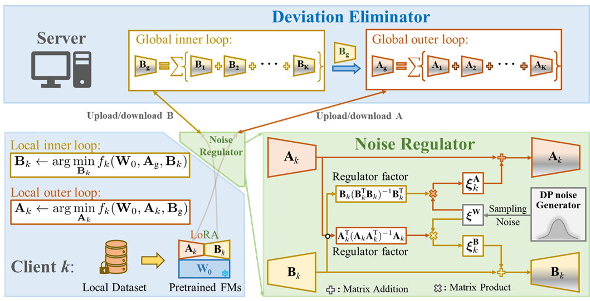

# DEeR

Code for our paper: "DEeR: Deviation Eliminating and Noise Regulating for Privacy-preserving Federated Low-rank Adaptation, under review, TMI 2024."

Integrating low-rank adaptation (LoRA) with federated learning (FL) has received widespread attention recently, aiming to adapt pretrained foundation models (FMs) to downstream medical tasks via privacy-preserving decentralized training. However, owing to the direct combination of LoRA and FL, current methods generally undergo two problems, i.e., aggregation deviation, and differential privacy (DP) noise amplification effect. To address these problems, we propose a novel privacy-preserving federated finetuning framework called Deviation Eliminating and Noise Regulating (DEeR). Specifically, we firstly theoretically prove that the necessary condition to eliminate aggregation deviation is guaranteing the equivalence between LoRA parameters of clients. Based on the theoretical insight, a deviation eliminator is designed to utilize alternating minimization algorithm to iteratively optimize the zero-initialized and non-zero-initialized parameter matrices of LoRA, ensuring that aggregation deviation always be zeros during training. Furthermore, we also conduct an in-depth analysis of the noise amplification effect and find that this problem is mainly caused by the “linear relationship” between DP noise and LoRA parameters. To suppress the noise amplification effect, we propose a noise regulator that exploits two regulator factors to decouple relationship between DP and LoRA, thereby achieving robust privacy protection and excellent finetuning performance. Additionally, we perform comprehensive ablated experiments to verify the effectiveness of the deviation eliminator and noise regulator. DEeR shows better performance on public medical datasets in comparison with state-of-the-art approaches.

<div align=center>

</div>

## Running
### Dependencies
```
pip install -r requirements.txt
```

### Scripts
- [x] download [Kvasir dataset](https://drive.google.com/file/d/1fzIIiZZYnpDtetjkdQOhSDTtjBkPbFCU/view?usp=sharing) and [OCT-8](https://zenodo.org/record/6496656/files/organmnist3d.npz?download=1) datasets and put them into the dir './data/'.
- [x]  Train DEeR framework on OCT-8 dataset.
```
python main.py --exp_name='exp1' \
    --data_dir='./data/Retinal_OCT-C8/' \
    --node_num=12 \
    --iid=0 \
    --dirichlet_alpha=0.1 \
    --local_model='CLIP' \
    --dataset='OCT' \
    --T=50 \
    --E=5 \
    --lr=0.01 \
    --num_classes=8 \
    --lora_r=8 \
    --device=0 \
    --method='LoRA' \
    --is_DP=1 \
    --C=0.1 \
    --epsilon=0.1 \
```
- [x] Train DEeR framework on Kvasir dataset.
```
python main.py --exp_name='exp1' \
    --data_dir='/home/meiluzhu2/data/kvasir-dataset-v2-processed-224' \
    --node_num=12 \
    --iid=0 \
    --dirichlet_alpha=0.1 \
    --local_model='CLIP' \
    --dataset='Kvasir' \
    --T=50 \
    --E=5 \
    --lr=0.01 \
    --num_classes=8 \
    --lora_r=8 \
    --device=0 \
    --method='FedLoRA' \
    --is_DP=1 \
    --C=0.3 \
    --epsilon=6 \
```

## Contact

  Meilu Zhu (meiluzhu2-c@my.cityu.edu.hk)


